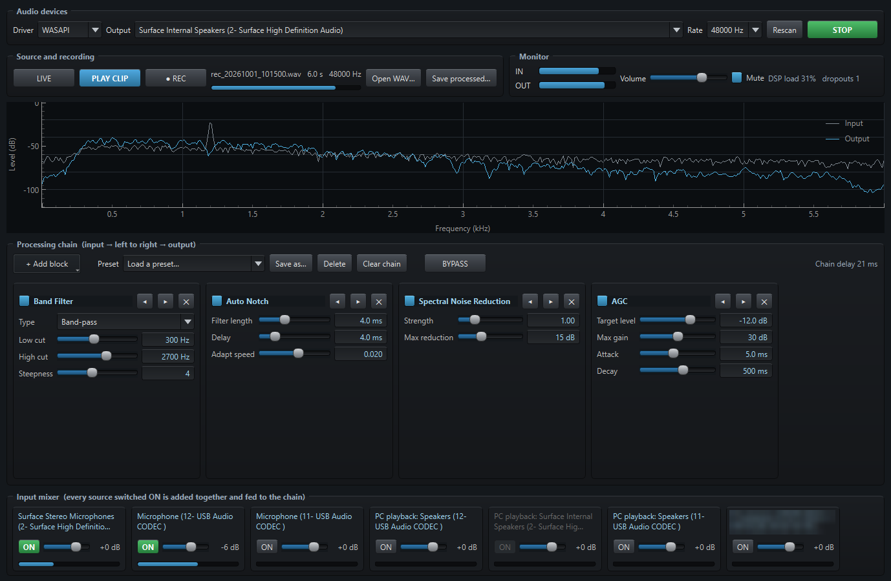

# Audio Processor

A free Windows audio filter chain for radio amateurs. **[Website and screenshots](https://lrizio.github.io/AudioProcessor/)** ·
**[Download for Windows](https://github.com/lrizio/AudioProcessor/releases/latest)**

Filter and modify audio from one or more inputs mixed together (a radio's USB
audio codec, a microphone, line-in, or what another program is playing) through a chain of processing blocks, and listen to the
result on any output device. A RECORD function captures the raw input so the
same stretch of audio can be replayed through the chain while the blocks are
adjusted.

    python run.py

Requires Python 3 with the packages in `requirements.txt`. Or skip Python: download
`AudioProcessor-1.2-windows.zip` from the [latest release](https://github.com/lrizio/AudioProcessor/releases/latest),
unzip it anywhere and run `Audio_Processor.exe` (not code-signed, so Windows SmartScreen may warn: *More info*, then
*Run anyway*).

## Using it

1. **Audio devices** - pick the driver (WASAPI is the default) and the output.
   In the **Input mixer** at the bottom, switch **ON** each source you want;
   everything that is on is added together, each at its own fader level, and
   fed to the chain. Then **START**. Choosing a different device, driver or rate
   while running switches over immediately. **Rescan** finds devices plugged
   in after the app was started.
2. **Processing chain** - **+ Add block** inserts a block at the end. Audio
   flows left to right. Each panel has a tick box (bypass), ◀ ▶ (reorder) and
   ✕ (remove). Sliders take effect immediately; type an exact value in the
   number box next to a slider.
3. **Spectrum** - grey is the input, blue is the output, so the effect of
   each block is visible. Drag/scroll to zoom the frequency axis.
4. **BYPASS** - skips the whole chain while lit, to compare with and without it.
5. **Presets** - save the whole chain under a name and load it back later.
   The chain and device choices are also remembered between runs.

### Processing audio from another program

The Input mixer has a **PC playback: …** strip for every output device.
Switching one on captures whatever is being played on that device - an SDR
program, a browser, a remote-control app - and runs it through the chain like
any other input, including REC.

The Output must be a *different* device from the one being captured, or the
processed audio would be captured again and echo; the strip for the current
Output device is greyed out for that reason. So point the other program (or Windows' default output) at one
device, capture that device here, and listen on another. If the captured
device is a real speaker you will hear the unprocessed audio from it too:
turn that speaker down, or use a virtual audio cable as the in-between device.
While nothing is playing the "dropouts" counter may tick; that is silence
arriving in bursts, not a fault.

### Recording, then processing

- **● REC** records the input mix, *before* any processing. Press it again to
  stop: the recording is saved to `recordings/rec_<date>_<time>.wav` and
  immediately starts looping through the chain (**PLAY CLIP** lights up).
- Adjust the blocks while the clip loops - the same audio every time, so
  changes are easy to compare.
- **LIVE** goes back to the input mix.
- **Open WAV…** loads any WAV file as the clip instead.
- **Save processed…** runs the whole clip through the current chain and
  writes the result to a new WAV.

Monitoring a microphone through nearby speakers will howl; use **Mute** or
headphones while recording from a mic.

## The blocks

| Category | Block | What it does |
|---|---|---|
| Filters | Band Filter | Low-pass, high-pass or band-pass with adjustable edges and steepness |
| Filters | Notch | Removes one fixed tone |
| Filters | CW Peak Filter | Narrow band-pass on the CW pitch |
| Adaptive | Auto Notch | Finds and removes steady tones by itself (don't use on CW) |
| Adaptive | LMS Noise Reduction | Keeps predictable signals (tones, CW), drops random noise |
| Spectral | Spectral Noise Reduction | Learns the noise floor per frequency and turns down noise-only bins; adds ~20 ms delay |
| Dynamics | AGC | Holds the output near a target level |
| Dynamics | Compressor | Reduces level above a threshold by a ratio |
| Dynamics | Limiter | Hard ceiling on peaks; put it last |
| Dynamics | Noise Gate | Mutes the audio when it falls below a threshold |
| Tone | Parametric EQ | Low shelf, two sweepable mid bands, high shelf |
| Tone | Gain | Plain level change |

## Adding your own block

Each block is one Python file containing one class. Drop the file into the
`blocks/` folder beside `run.py`, restart, and it appears in **+ Add block**
with its controls built automatically from its `params` list.

`blocks/_template.py` is a complete worked example (a tremolo): copy it to a
name without the leading underscore and edit. The contract is in
`audioproc/block.py`:

- `params` - a list of `Param(key, label, lo, hi, default, unit, scale, kind)`.
  Each value is available as `self.<key>`.
- `configure(fs)` - design the filter from the current values. Called on start
  and on every slider move.
- `process(x)` - one chunk of mono samples in, the same length out. Anything
  with memory must live on `self` so it continues across chunks; `SosFilter`
  (IIR filters) and `FrameBlock` (FFT processing) handle that for you.
- `reset()` - clear that memory.

A block that raises an error is bypassed and its panel says why; the audio
keeps running. The built-in blocks in `audioproc/blocks/` are the same kind of
file and serve as further examples.

## Building the .exe

    powershell -ExecutionPolicy Bypass -File scripts\build_exe.ps1

Regenerates `icon.ico` (`scripts/make_icon.py`), builds the single-file
`build\Audio_Processor.exe` with PyInstaller and (re)creates the
"Audio Processor" Desktop shortcut. Takes about four minutes.

The exe keeps its `presets\`, `recordings\`, `settings.json` and user
`blocks\` folder beside itself, and creates the presets and the block template
there on first run. `Audio_Processor.exe --selftest report.json` writes what
the build can see (blocks, presets, audio devices) without opening a window.
`--livetest report.json` runs the real window for ten seconds on a copy of the
settings with the output muted, adds a Band Filter and measures whether the
chain's output differs from its input (and that BYPASS removes the difference).

## User guide

`Audio Processor User Guide.pdf` (in the release zip) is the end-user guide. To regenerate it from source (it is
written to `build\`):

    python scripts/guide_screens.py     # only when the screen has changed
    python build_user_guide.py

`guide_screens.py` runs the real window for a few seconds with the output
muted and writes the screenshots to `docs/guide/`.

## Notes

- Processing is mono. Stereo inputs are mixed down; the output is the same
  signal on both channels.
- Expect roughly a tenth of a second from input to output (more with Spectral Noise
  Reduction in the chain). Fine for listening to received audio; too long to
  monitor your own voice comfortably.
- To feed the processed audio into another program (WSJT-X, JTDX…), install a
  virtual audio cable and select it as the output device here and as the
  input device there.
- Every input and the output run on separate clocks. The app absorbs the
  drift by occasionally dropping or padding a few milliseconds; the
  "dropouts" counter in the Monitor box shows how often the output ran dry.
- `python tests/test_blocks.py` checks every block against synthetic signals
  (no audio hardware needed).

## Licence and disclaimer

Audio Processor is free software under the [MIT License](LICENSE). It is provided **as is, without warranty of any
kind**, and you use it at your own risk. Be careful with sound levels, and think before routing its output into a
radio's transmit audio. Please read the full [DISCLAIMER](DISCLAIMER.md).

Audio Processor is not affiliated with or endorsed by any radio manufacturer or library author. All trademarks belong
to their owners.

73 de VK3EI
